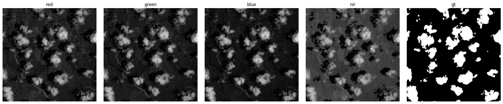
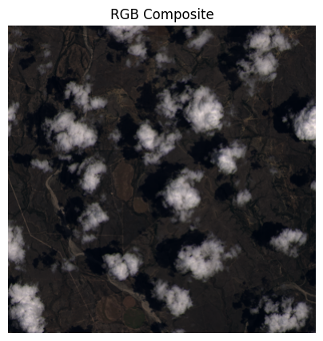
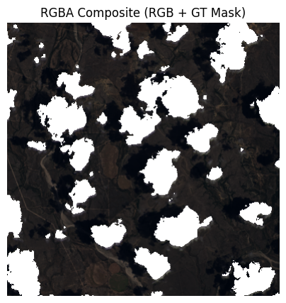
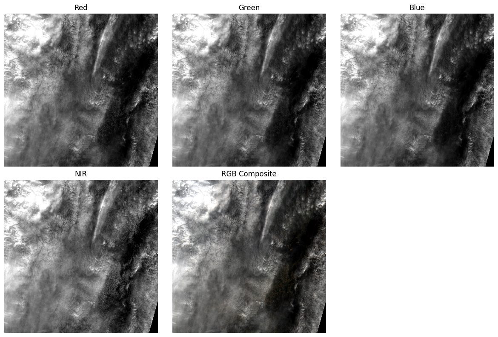
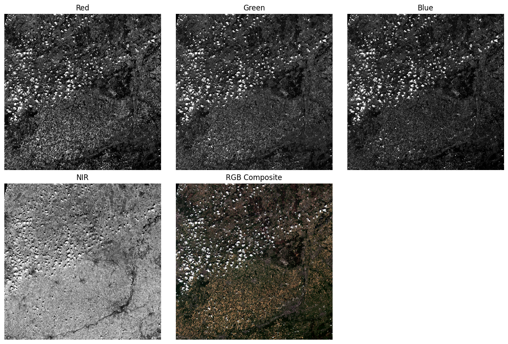

# Get and analyse satellite images

## Training dataset analysis

From [this](https://www.kaggle.com/datasets/sorour/38cloud-cloud-segmentation-in-satellite-images) dataset, we create a CSV dataset containing the paths of all files downloaded locally (8400 lines).

Here are the channels available for an image:

We want to identify clouds on RGB channels using the TARGET mask.

Here's a compiled RGB image (although each channel will be separated for the model):

And here's a compiled RGBA image with the clouds removed (this will be the post-processed output image):

## Download and analyze Sentinel-2 data

We download the data from the public S3 bucket.
These are JPEG2000 images, so we need to use `rasterio` rather than `Pillow`.

`rasterio` is designed for :

- GeoTIFF / JP2 reading
- Geospatial metadata (CRS, bbox), access to coordinates, UTM, - projection, not `Pillow`.
- Multi-band images (e.g.: 13 bands) handles band stacks perfectly, `Pillow` only understands RGB / L / P
- Support for NIR, SWIR, 16-bit+ bands, whereas `Pillow` is limited to 8-bit
- GIS interoperability (QGIS, GDAL)

| channel | sentinel code |
| ------- | ------------- |
| R | B04 |
| G | B03 |
| B | B02 |
| NIR | B08 |

