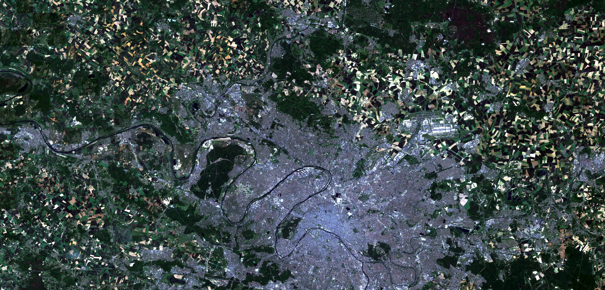

# Welcome

Hi there!

I'm Tristan and I'm doing this project to learn how to use satellite images and deepen my knowledge of deep learning.

* This is my first experience with PyTorch (I was using Tensorflow)
* First experience with real satellite data (Sentinel-2)

  
## Pipeline

1. Download Sentinel-2 images from the same location on several dates.
2. Run the cloud segmentation model and generate a “cloud mask”.
3. From this mask, remove images that are too cloudy from the dataset.
4. Transform the mask into alpha (invert it to remove the remaining clouds).
5. Stack the RGBA images to build a cloud-free mosaic.
