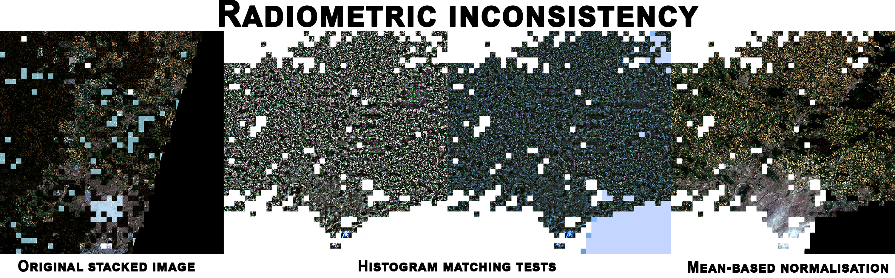

# Inference pipeline

We start by selecting a time range from which we will create our composite image.
For example, we would like to use all Sentinel-2 captures from May 2025 in Paris.

We also choose an image to serve as a color reference. It doesn't necessarily have to be from the same geographic area, the important thing is that the colors are similar.
So, we shouldn't use an ocean image as a reference for a forest image.

## Preprocessing

After loading the Sentinel-2 images, we apply several preprocessing steps.
Since the images were captured at different times and on different days, brightness and colors are never consistent.

We start by matching the histograms of the images to that of the reference image.

Then, we apply a contrast stretching to the input image using the 2nd and 98th percentiles.
This method rescales the pixel values of the input image so that the 2nd percentile maps to 0 and the 98th percentile maps to 1, with values outside this range clipped accordingly.
This enhances the contrast of the image by reducing the effect of outliers.

Finally, we apply the Gray World color balance algorithm to a stacked image.
It assumes that the average color of a scene is gray, and adjusts each channel so that their averages are equal, effectively correcting color casts in the image.

## Split into tiles

Each image has a `10980*10980px` size whereas the model has been trained on `384*384px` images.
We have to split it into small squares (tiles) and then give it to the model.

To do this, we create a tile grid that will serve both as a cutting template for all the images and as a template for reconstructing them.

## Inference

The predicted mask for an image:

The goal is now to keep the cloudless tiles only.

## Filter tiles

To filter out cloudy tiles, we keep only those that have less than a certain percentage of pixels considered white, and we add the RGB tile to the reconstruction grid.

Each time a tile is added to the grid, we calculate the number of remaining tiles to process in order to stop the inference once the entire image has been completed.

## Results

### Paris: August 2024 - May 2025

