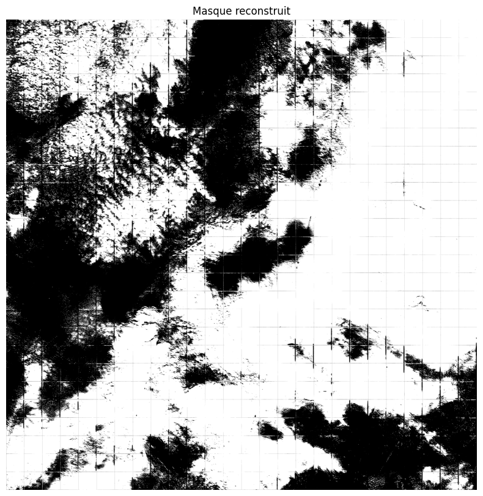
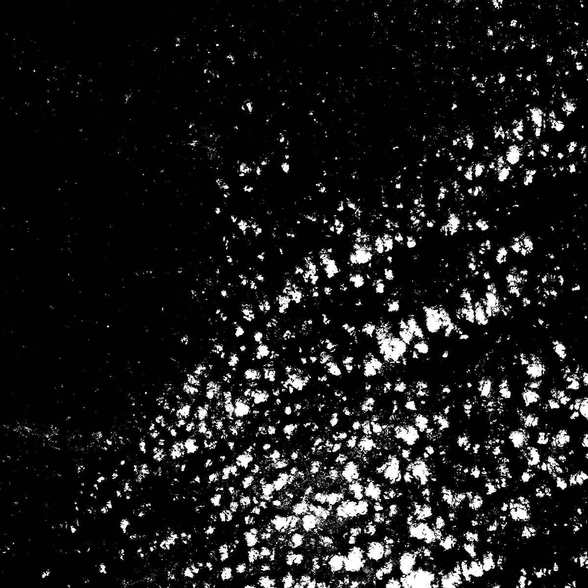
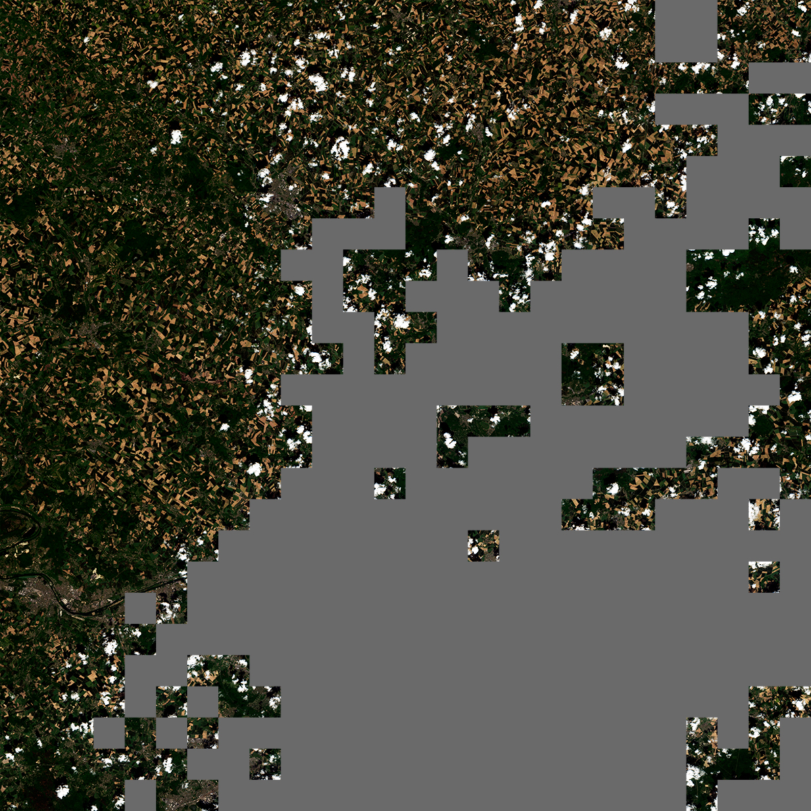
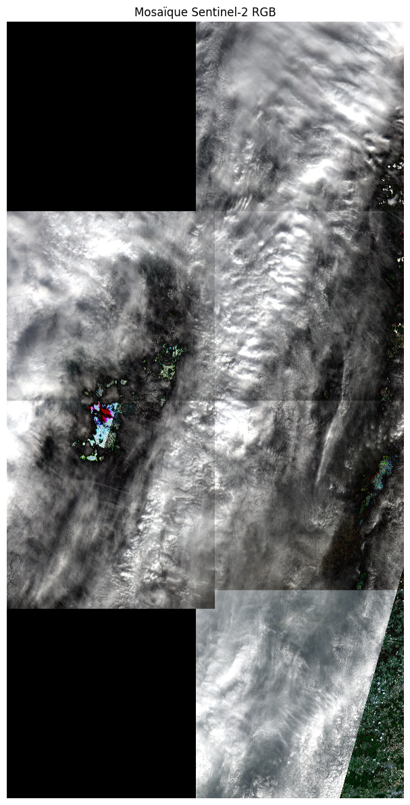

# Inference pipeline

The goal is to:

1. Give an image to the model so that it can identify cloudy areas.
2. Remove images that are too cloudy, based on the percentage of white pixels in the predicted mask.
3. Invert the mask and transform it into alpha, then build an RGBA image.
4. Create a mosaic by assembling several images of the same area but at different dates.

## Split a Sentinel-2 tile

Each tile has a `10180*10180px` size whereas the model has been trained on `384*384px` images.
We have to split it into small squares and then give it to the model.

## Inference

The predicted mask for a tile at different dates:

The goal is now to keep the cloudless subtiles only.

## Filter tiles

## Create the mosaic

