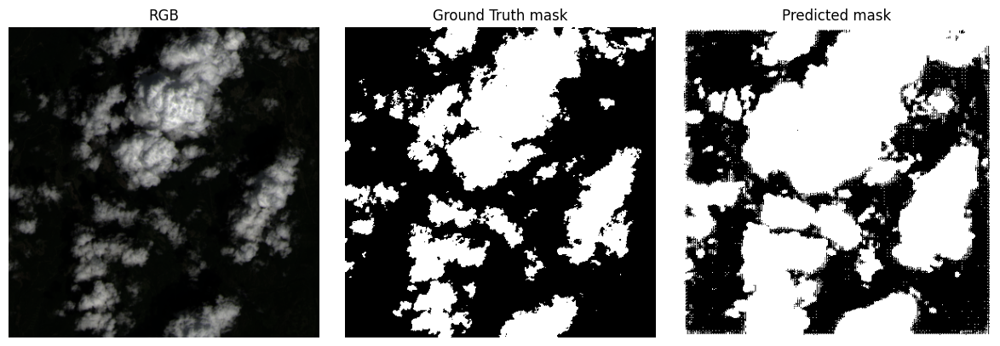
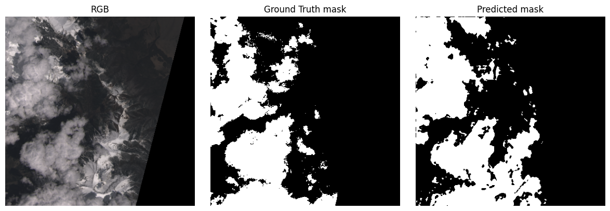
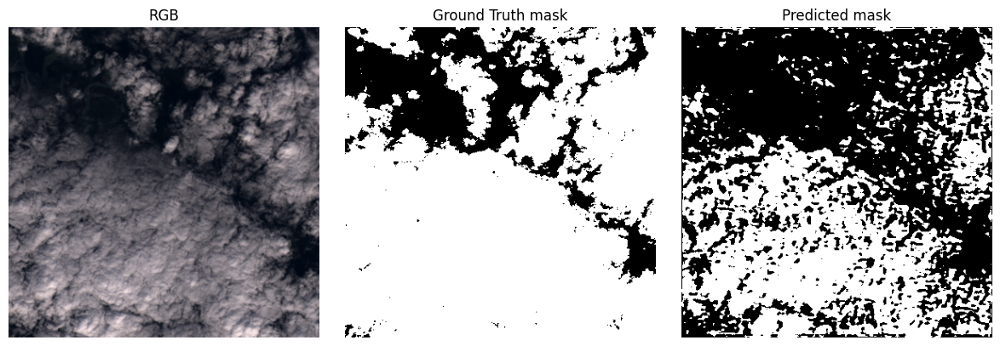
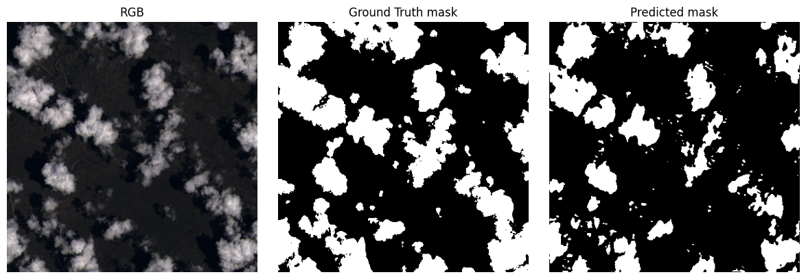

# Model Training

## Create a custom U-net

A U-Net model is a type of convolutional neural network (CNN) designed specifically for image segmentation tasks.

There are two main parts:

1. **Encoder:**
   Convolution series + max pooling which progressively reduces the image resolution while increasing the number of channels to understand the image context.

2. **Decoder:**
   Series of transposed convolutions (or upsampling) that increase resolution.

The result is a binary mask. In our case, this will be the pixels that correspond to clouds.

Let's train with this:

```py
SimpleUNet(
  (enc1): DoubleConv(
    (conv): Sequential(
      (0): Conv2d(3, 64, kernel_size=(3, 3), stride=(1, 1), padding=(1, 1))
      (1): BatchNorm2d(64, eps=1e-05, momentum=0.1, affine=True, track_running_stats=True)
      (2): ReLU(inplace=True)
      (3): Conv2d(64, 64, kernel_size=(3, 3), stride=(1, 1), padding=(1, 1))
      (4): BatchNorm2d(64, eps=1e-05, momentum=0.1, affine=True, track_running_stats=True)
      (5): ReLU(inplace=True)
    )
  )
  (pool1): MaxPool2d(kernel_size=2, stride=2, padding=0, dilation=1, ceil_mode=False)
  (enc2): DoubleConv(
    (conv): Sequential(
      (0): Conv2d(64, 128, kernel_size=(3, 3), stride=(1, 1), padding=(1, 1))
      (1): BatchNorm2d(128, eps=1e-05, momentum=0.1, affine=True, track_running_stats=True)
      (2): ReLU(inplace=True)
      (3): Conv2d(128, 128, kernel_size=(3, 3), stride=(1, 1), padding=(1, 1))
      (4): BatchNorm2d(128, eps=1e-05, momentum=0.1, affine=True, track_running_stats=True)
      (5): ReLU(inplace=True)
    )
  )
  (pool2): MaxPool2d(kernel_size=2, stride=2, padding=0, dilation=1, ceil_mode=False)
  (bottleneck): DoubleConv(
    (conv): Sequential(
...
      (5): ReLU(inplace=True)
    )
  )
  (final): Conv2d(64, 1, kernel_size=(1, 1), stride=(1, 1))
)
```

### Results

Results for a first training of 10 epochs with only 100 images:





Results for a second training of 9 epochs with 4200 images:






