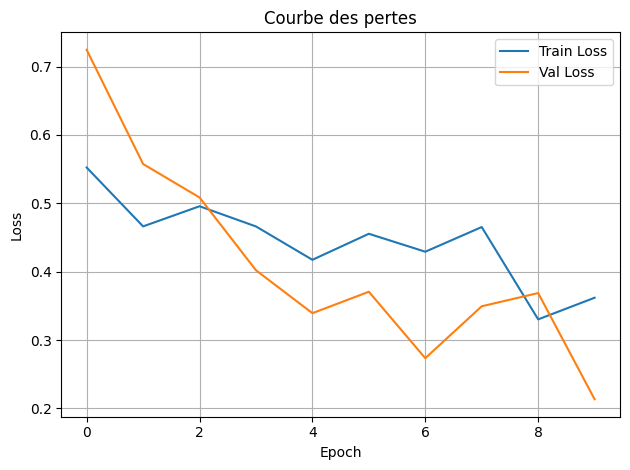

# Model Training

## Create a custom U-Net

A U-Net model is a type of convolutional neural network designed specifically for image segmentation tasks.

There are two main parts:

1. **Encoder:**
   Convolution series + max pooling which progressively reduces the image resolution while increasing the number of channels to understand the image context.

2. **Decoder:**
   Series of transposed convolutions (or upsampling) that increase resolution.

The result is a binary mask. In our case, this will be the pixels that correspond to clouds.

### Baseline (Simple U-net with 3 in_channels (R, G, B))

Let's train with this:

```py
SimpleUNet(
  (enc1): DoubleConv(
    (conv): Sequential(
      (0): Conv2d(3, 64, kernel_size=(3, 3), stride=(1, 1), padding=(1, 1))
      (1): BatchNorm2d(64, eps=1e-05, momentum=0.1, affine=True, track_running_stats=True)
      (2): ReLU(inplace=True)
      (3): Conv2d(64, 64, kernel_size=(3, 3), stride=(1, 1), padding=(1, 1))
      (4): BatchNorm2d(64, eps=1e-05, momentum=0.1, affine=True, track_running_stats=True)
      (5): ReLU(inplace=True)
    )
  )
  (pool1): MaxPool2d(kernel_size=2, stride=2, padding=0, dilation=1, ceil_mode=False)
  (enc2): DoubleConv(
    (conv): Sequential(
      (0): Conv2d(64, 128, kernel_size=(3, 3), stride=(1, 1), padding=(1, 1))
      (1): BatchNorm2d(128, eps=1e-05, momentum=0.1, affine=True, track_running_stats=True)
      (2): ReLU(inplace=True)
      (3): Conv2d(128, 128, kernel_size=(3, 3), stride=(1, 1), padding=(1, 1))
      (4): BatchNorm2d(128, eps=1e-05, momentum=0.1, affine=True, track_running_stats=True)
      (5): ReLU(inplace=True)
    )
  )
  (pool2): MaxPool2d(kernel_size=2, stride=2, padding=0, dilation=1, ceil_mode=False)
  (bottleneck): DoubleConv(
    (conv): Sequential(
...
      (5): ReLU(inplace=True)
    )
  )
  (final): Conv2d(64, 1, kernel_size=(1, 1), stride=(1, 1))
)
```

Results for a first training of 10 epochs with only 100 images:


Results for a second training of 9 epochs with 4200 images:


This very first model doesn't do too badly, although unfortunately, due to an error in the pipeline, I have to abandon it.

In addition, it was only based on the R, G, B layers. I had assumed that Sentinel-2 data would be quite difficult to retrieve, so I wouldn't have the NIR (near infrared) layer.
However, it was actually quite simple, so I redid the whole thing.

### U-net with 4 in_channels (R, G, B, NIR)

This U-net is based on channels R, G, B, NIR.

As we're dealing with binary segmentation (each pixel is classified as "cloudy" or "not cloudy"), we can use the `BCEWithLogitsLoss` loss function.
This is a function that applies a sigmoid to the model output and then a Binary Cross-Entropy between the target and the ground truth.

> Remember: the sigmoid is a symmetrical S-curve centered on 0.5, which crushes the extreme values. It is used to calculate probabilities between 0 and 1.
> Binary Cross-Entropy measures the error between a predicted probability and an actual target value. The smaller the error, the better.

#### First experiment




I'm very surprised at the quality of the prediction, given that I've only given a subset of 100 lines (some of which are completely empty) out of 10 epochs.
However, it's clear that he's still confusing snow-capped mountains with clouds.

#### Second experiment


