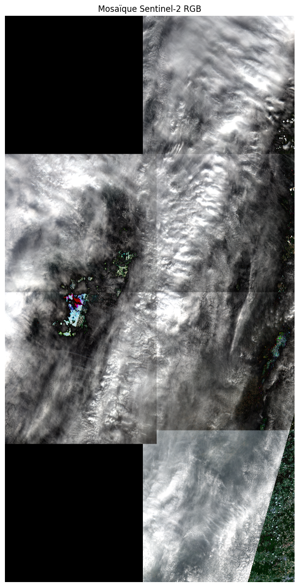

# Segmentation model

## Training dataset analysis

These are the available channels for one image:

We want to identify the clouds on RGB channels thanks to the GT mask.

This is a compiled RGB image (this will be used as input for the model):

This is a compiled RGBA image with clouds removed (this will be the postprocessed output image):

## Train custom U-net

Results for a first training of 10 epochs:

## Download and analyse Sentinel-2 data

On télécharge les données depuis le bucket S3 public.
Ce sont des images en JPEG2000, nous devons donc utiliser `rasterio` plutôt que `Pillow`.

`rasterio` est fait pour:

- Lecture GeoTIFF / JP2
- Métadonnées géospatiales (CRS, bbox), accède aux coordonnées, UTM, - projection, pas `Pillow`
- Images multi-bandes (ex : 13 bandes) gère parfaitement les stacks de bandes, `Pillow` ne comprend que RGB / L / P
- Support NIR, SWIR, bandes 16-bit+ alors que `Pillow` est limité à 8-bit
- Interopérabilité SIG (QGIS, GDAL)

|channel|sentinel code|
|-|-|
|R|B04|
|G|B03|
|B|B02|
|NIR|B08|

## Mosaic

